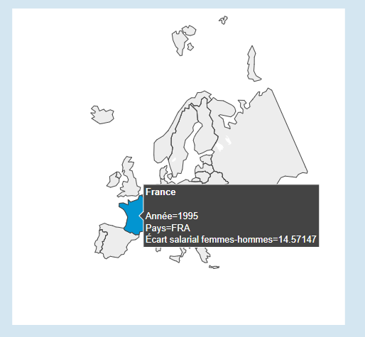
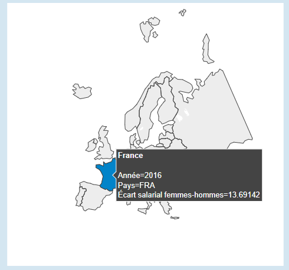
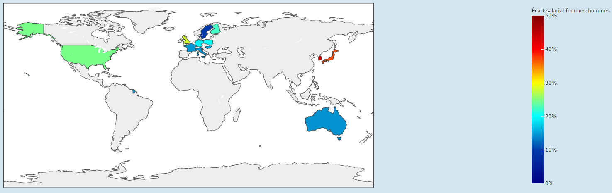
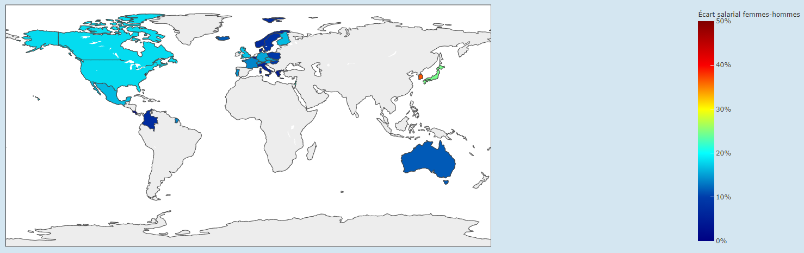
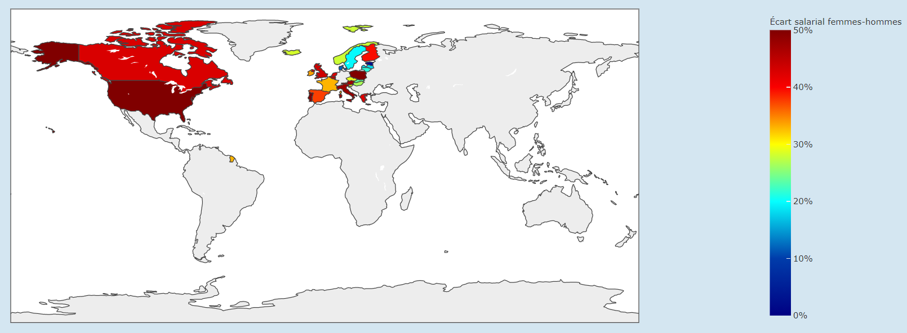
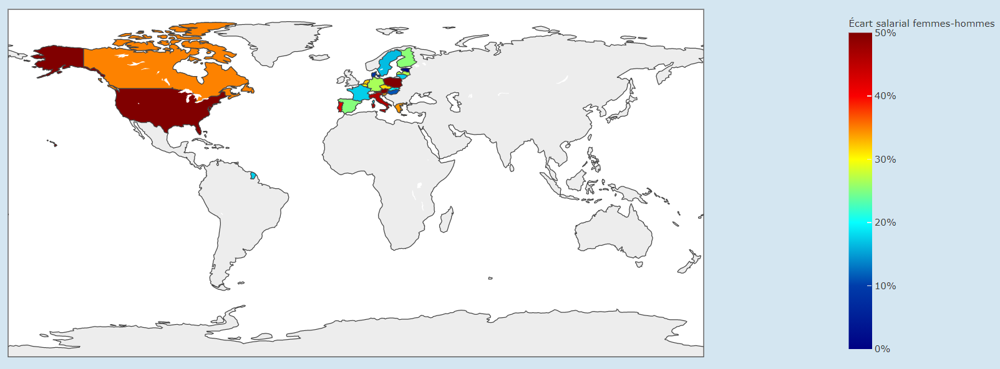

# Projet Python : Écart salarial femmes-hommes 

Projet python dont l'objectif est de créer un dashboard interactif permettant de visualiser et d'analyser de manière pertinente un jeu de données.

## 1 - User Guide

### **Installation**

*Installer python au préalable sur la machine utilisée*

##### Ouvrir l'invite de commande

> *Windows* et *Linux* : chercher en tapant '*terminal*' dans la barre de recherche.

##### Se placer dans le dossier du projet

> Utiliser la commande `cd <chemin du répertoire>` 
> par exemple : 'cd Desktop/projet-python-e4-dashboard'

##### Installer tous les modules/packages nécessaires de python

Exécuter la commande `pip install -r requirements.txt`

ou `python3 -m pip install -r requirements.txt` dans le terminal.

### **Utilisation**

*Après avoir téléchargé le dossier du projet :*

- Ouvrir le terminal

- Se placer dans le dossier du projet

- Exécuter la commande `python3 main.py` pour démarrer l'application

- Attendre quelques instants le chargement de l'application

Si tout se passe bien :

- Ouvrir son navigateur internet et afficher le dashboard en *localhost* (entrez l'adresse suivante dans votre navigateur : http://127.0.0.1:5000/)

- Appuyer CTLR+C dans le terminal pour quitter l'application

## 2 - Developer Guide

#### Architecture du projet

Le projet est constitué de :

- 4 dossiers :

  - **pycache** : contient une version compressée des modules python afin d'accélérer leur chargement.
  - **app** : contient l'ensemble du code de l'application.
  - **data** : contient les fichiers .csv des données utilisées pour ce projet.
  - **rapport** : contient les images affichées dans le rapport d'analyse ci-dessous.

* 3 fichiers :

  * **main.py** : fichier python permettant de lancer l'application.
  * **requirements.txt** : liste des modules/packages utilisés dans cette application.
  * **README.md**

#### Architecture du dossier **app**

Le dossier app est constitué d'un dossier *pycache* et de 7 fichiers python :

- **init.py** : permet de créer l'application *flask*.
- **callbacks.py** : contient les fonctions qui permettent d'obtenir des graphiques interactifs.
- **dash.py** : permet de convertir l'application *flask* en une application *Dash*, permettant ainsi la création du dashboard.
- **data.py** : contient le code permettant de trier les jeux de données contenus dans le dossier .data
- **figures.py** : contient les fonctions qui créent les différentes figures et graphiques du dashboard.
- **layout.py** : contient le code permettant de disposer les différents composants et figures sur la page, déterminant ainsi l'aspect du dashboard.
- **navbar.py** : contient le code déterminant l'aspect de la barre de navigation située en haut de la page.

#### Fonctions des différents fichiers

- **callbacks.py** :
  - *update_carte(selected_countries, selected_salarial)*
  > Met à jour la carte choroplèthe en fonction des pays choisis dans le menu déroulant, ainsi qu'en fonction du type d'emploi sélectionné.

  - *update_histogramme(selected_countries, selected_salarial, selected_year)*
  > Met à jour l'histogramme en fonction des pays et du type d'emploi choisis, ainsi que de l'année sélectionnée sur le slider situé en dessous.

  - *update_diagramme(selected_countries, selected_salarial, selected_year)*
  > Met à jour le diagramme en barres en fonction des pays et du type d'emploi choisis, ainsi que de l'année sélectionnée sur le slider situé en dessous.

  - *update_slider(selected_countries, selected_salarial)*
  > Met à jour le slider en fonction des pays et du type d'emploi choisis pour pouvoir sélectionner des années où des données sont présentes.

  - *update_dropdown(selected_salarial)*
  > Permet d'activer ou désactiver le menu déroulant en fonction du type d'emploi sélectionné.

  - *update_graphe(selected_countries, selected_salarial)*
  > Met à jour le premier graphique en fonction des pays choisis dans le menu déroulant, ainsi qu'en fonction du type d'emploi sélectionné.

- **figures.py** :
  - *create_carte(df,focus='world')*
  > Crée la carte choroplèthe avec le dataframe et le focus donnés en paramètres.

  - *create_histogramme(df, year)*
  > Crée l'histogramme avec le dataframe et l'année donnés en paramètres.

  - *create_diagramme(df, year)*
  > Crée le diagramme en barres avec le dataframe et l'année donnés en paramètres.

  - *create_graphe(df)*
  > Crée le premier graphique avec le dataframe donnée en paramètre.

## 3 - Rapport d'analyse

#### Définition de l'écart salarial femmes-hommes :

L’écart salarial entre les femmes et les hommes est défini comme la différence entre le salaire médian des hommes et des femmes rapportée au salaire médian des hommes. Les données se rapportent d’une part aux salariés à plein temps et de l’autre aux non-salariés.

#### Analyse :

###### **Introduction**

La différence de salaires entre les hommes et les femmes est un fait flagrant concernant l'égalité hommes-femmes en France mais aussi partout dans le monde. La question que nous pouvons nous poser est : l'écart de salaire femmes-hommes se réduit-il au fil des années ?

###### **Le cas de la France**

En France, l'écart salarial en 1995 est de 14,6% pour des personnes salariées.

Cet écart est évalué à 13,7% en 2016. On observe une légère baisse, mais l'évolution reste très faible et semble stagner en 20 ans.

###### **Dans le reste du monde**

Mais qu'en est-il dans le reste du monde ?

En 1995, l'écart salarial en Europe varie entre 10 et 28% selon les pays. Aux USA, l'écart est évalué à 24,6%. En Australie,  14,5%. Et enfin en Asie de l'Est, l'écart salarial femmes-hommes est de 37% au Japon et de 44% en Corée du Sud !

On remarque une grande diversité de l'inégalité hommes-femmes au niveau des salaires selon les régions du monde. 
Heureusement, cet écart salarial semble diminuer dans l'entièreté du globe au fil des ans pour atteindre des valeurs en 2016 de 7 à 17% en Europe, 17% en Amérique du Nord, 11,5% en Australie, 24,6% au Japon et 36,7% en Corée du Sud.

###### **Le cas des auto-entrepreneurs**

Le cas des personnes non-salariées est plus délicat. En effet, beaucoup moins de personnes sont auto-entrepreneurs dans le monde et il sera plus difficile d'évaluer la pertinence des écarts de salaire observés dans le monde.

En 2006, l'écart salarial varie de 12 à 60% selon les pays,les plus grosses inégalités étant observées en Amérique du Nord.

Nénmoins, on observe de manière globale une baisse de cet écart salarial dans le monde au fil des années. En 2016, les valeurs varient entre 8 et 56%.

###### **Conclusion**

Le cas de la France laisse penser que l'écart de salaire entre les hommes et les femmes reste sensiblement le même depuis plus 20 ans. 
Cependant, en comparant l'écart salarial en France au reste du monde, on remarque finalement que la France fait partie des pays les plus égalitaires en terme de salaire dans le monde ! 
Les plus grosses inégalités sont observés en Amérique du Nord, et surtout en Asie. On peut supposer que cela est dû à une grande différence culturelle et de société.

Malgré cela, on remarque une diminution incontestable de l'écart salarial femmes-hommes, et ce, dans l'ensemble des pays du monde. Ainsi, même si certains pays sont encore loin d'être proche d'une égalité totale en terme de salaire entre les hommes et les femmes, tout le monde se dirige à son rythme dans la bonne voie.

#### Aller plus loin...

Notre analyse porte sur la différence de salaires entre les hommes et les femmes de manière gobale. 
Cependant, il pourra être pertinent de s'intéresser à l'écart salarial femmes-hommes au sein d'un même secteur d'activité (Agriculture, Industrie, Services...), voire au sein d'un métier précis.

## Dataset

Data utilisée pour l'analyse : https://data.oecd.org/fr/earnwage/ecart-salarial-femmes-hommes.htm

Data secondaire (utilisée pour avoir les noms des pays et des continents en français) :

  - https://sql.sh/ressources/sql-pays/sql-pays.csv
  - https://pkgstore.datahub.io/JohnSnowLabs/country-and-continent-codes-list/country-and-continent-codes-list-csv_csv/data/b7876b7f496677669644f3d1069d3121/country-and-continent-codes-list-csv_csv.csv
